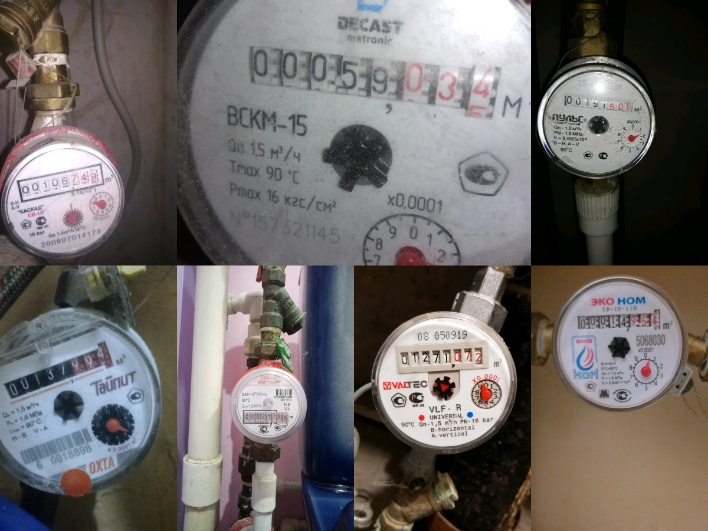
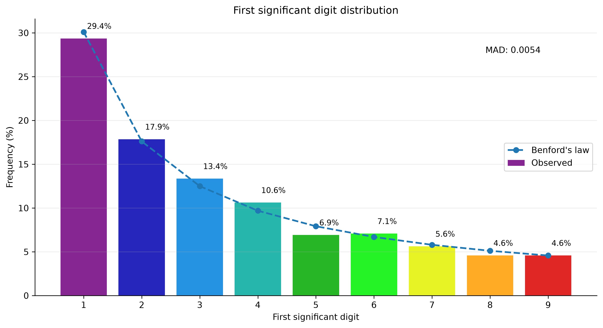
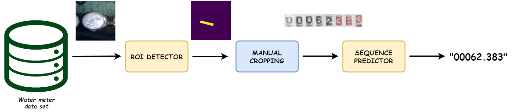

<!-- Water Meter OCR
├── Project overview
├── Dataset
├── Pipeline
├── ROI detection
│   ├── Model
│   ├── Training
│   └── Results
├── Sequence recognition
│   ├── CRNN
│   └── Multi-task model
├── Repository structure
├── Usage
└── Notes on the JAX reimplementation -->

# Water Meter OCR

> This repository is a JAX reimplementation of a TensorFlow-based water-meter OCR proof of concept. The goal of the rewrite is to preserve and clarify the original computer-vision and sequence-recognition pipeline while exploring modern JAX/Flax tooling.

## Project overview

The objective of the project is to extract numerical readings from photographs of analog water meters.

This is more challenging than conventional OCR because the input images are not standardized. The meters appear at different scales and orientations, under varying illumination, and with different display layouts and backgrounds.

  

The solution therefore separates the problem into two learning tasks:

1. **Region-of-interest detection** — a U-Net segmentation model identifies the display containing the meter reading.
2. **Sequence recognition** — the cropped and aligned display is passed to a sequence model that predicts the complete reading.

The original implementation used TensorFlow/Keras. The current version reimplements the same pipeline in **JAX/Flax**.

## Dataset

The project uses the **Yandex Toloka Water Meters Dataset**, collected through the Yandex.Toloka crowdsourcing platform and distributed through Kaggle.

- **Source**: [Yandex Toloka Water Meters Dataset](https://www.kaggle.com/datasets/tapakah68/yandextoloka-water-meters-dataset)
- **Number of images**: 1,244
- **Content**:
  - water-meter photographs;
  - segmentation masks for the display region;
  - reading labels used for sequence prediction.

The dataset contains real water-meter images with meaningful diversity in meter type, pose, illumination, and reading length.  
A useful sanity check is the distribution of the first significant digit in the readings.

  

The observed first-digit frequencies are broadly consistent with Benford's law, which is a common pattern in naturally occurring cumulative numerical quantities. In this case, it provides an additional indication that the readings behave like real-world meter values.

## Pipeline

The full OCR solution follows a **two-stage pipeline**:

  

### 1. ROI detection

A segmentation model detects the **region of interest (ROI)** corresponding to the reading display.  
This step is necessary because the full images contain large amounts of irrelevant visual information: pipes, meter casing, screws, labels, shadows, and background clutter.

### 2. Cropping and alignment

Once the display region is detected, the corresponding area is cropped and geometrically normalized.  

### 3. Sequence prediction

The cropped display is then passed to a sequence-recognition model that predicts the meter reading as an ordered character sequence.

### Why a two-stage pipeline?

A direct end-to-end OCR approach on the raw full image would need to solve localization and sequence recognition simultaneously under a heavy visual variability. Separating the task into **detection** and **reading** simplifies the learning problem and reflects the structure of the original project.

## ROI detection

TODO: